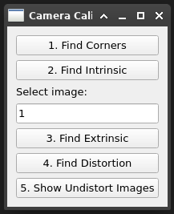
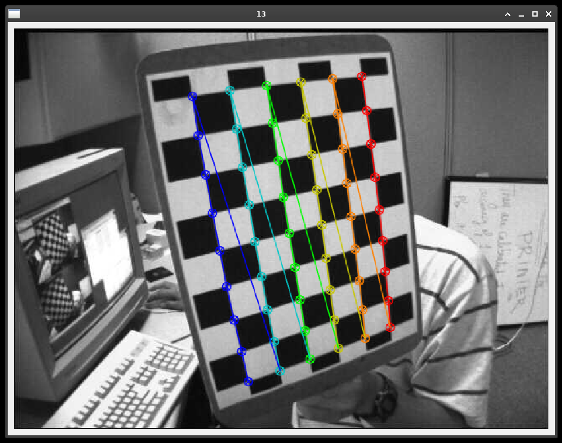
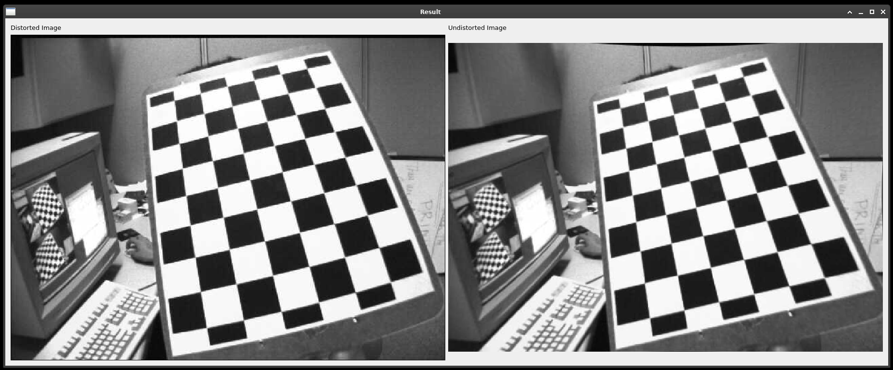

# camera-calibration-opencv

Camera calibration with OpenCV.

To execute: `python main.py`

## Screenshots

- **Button 1:** Show corners of every chessboard image:
  

- **Button 5:** Show undistort images of selected chessboard image:
  